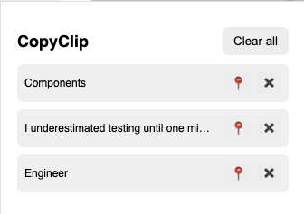
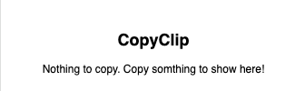

## CopyClip

CopyClip is a lightweight clipboard manager that helps you store and manage your copied text snippets efficiently. With an intuitive interface and quick access, it enhances productivity by keeping your clipboard history organized and easily accessible.

  

